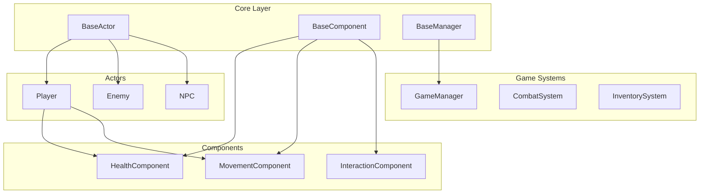

# API Reference

Welcome to the **Ashes of Velsingrad** API documentation. This section contains the automatically generated API reference for all public classes, interfaces, and methods in the codebase.

## Overview

This API documentation is automatically generated from XML documentation comments in the C# source code. It provides detailed information about all public APIs, including classes, methods, properties, events, and their usage examples.

## Quick Navigation

### 🎮 Core Game Systems

| Namespace | Description | Key Classes |
|-----------|-------------|-------------|
| **[AshesOfVelsingrad.Systems](~/documentation/api/AshesOfVelsingrad.Systems.yml)** | Game logic systems | `CombatSystem`, `InventorySystem` |
| **[AshesOfVelsingrad.Managers](~/documentation/api/AshesOfVelsingrad.Managers.yml)** | Global managers | `GameManager`, `AudioManager` |

### 🖥️ User Interface

| Namespace | Description | Key Classes |
|-----------|-------------|-------------|
| **[AshesOfVelsingrad.UI.Menus](~/documentation/api/AshesOfVelsingrad.UI.Menus.yml)** | Game menus | `MainMenu`, `PauseMenu`, `SettingsMenu` |

### 📊 Data & Utilities

| Namespace | Description | Key Classes |
|-----------|-------------|-------------|
| **[AshesOfVelsingrad.Data](~/documentation/api/AshesOfVelsingrad.Data.yml)** | Data structures | `ItemData`, `CharacterData`, `GameSettings` |
| **[AshesOfVelsingrad.Utilities](~/documentation/api/AshesOfVelsingrad.Utilities.yml)** | Helper classes | `MathHelpers`, `StringExtensions` |

## Architecture Overview

The API is organized following our [component-based architecture](~/documentation/docs/technical/architecture.md):



## Key Design Patterns

### Component Pattern
Most game entities inherit from `BaseActor` and use components for modular functionality:

```csharp
// Example usage (see full documentation in BaseActor)
var player = new Player();
player.AddComponent<HealthComponent>();
player.AddComponent<MovementComponent>();
```

### Manager Pattern
Global systems follow the singleton manager pattern:

```csharp
// Example usage (see full documentation in GameManager)
GameManager.Instance.ChangeState(GameState.Playing);
```

### Event-Driven Communication
Systems communicate through Godot signals:

```csharp
// Example usage (see full documentation in HealthComponent)
healthComponent.HealthChanged += OnHealthChanged;
healthComponent.Death += OnPlayerDeath;
```

## Common Usage Patterns

### Creating Game Entities

```csharp
// Standard actor creation pattern
var enemy = new Enemy();
enemy.AddComponent(new HealthComponent { MaxHealth = 50 });
enemy.AddComponent(new MovementComponent { Speed = 200.0f });

// See: BaseActor.AddComponent<T>()
```

### Handling Events

```csharp
// Standard event subscription pattern
public override void _Ready()
{
    var combat = GetNode<CombatSystem>("CombatSystem");
    combat.DamageDealt += OnDamageDealt;
}

// See: Signal attribute documentation
```

### Managing Game State

```csharp
// Standard state management pattern
GameManager.Instance.ChangeState(GameState.MainMenu);
SceneManager.Instance.ChangeScene("MainMenu");

// See: BaseManager pattern documentation
```

## API Conventions

### Naming Conventions

Following our [coding standards](~/documentation/docs/technical/coding-standards.md):

- **Classes**: PascalCase (`PlayerController`, `InventorySystem`)
- **Methods**: PascalCase (`GetComponent`, `TakeDamage`)
- **Properties**: PascalCase (`CurrentHealth`, `MaxSpeed`)
- **Events/Signals**: PascalCase (`HealthChanged`, `PlayerDied`)
- **Private Fields**: camelCase with underscore (`_currentHealth`, `_isAlive`)

### Signal Naming

All Godot signals follow the EventHandler convention:

```csharp
[Signal]
public delegate void HealthChangedEventHandler(int currentHealth, int maxHealth);

[Signal]
public delegate void DeathEventHandler();
```

### Export Attributes

Designer-configurable values use the `[Export]` attribute:

```csharp
[Export] public float Speed { get; set; } = 300.0f;
[Export] public int MaxHealth { get; set; } = 100;
```

## Documentation Standards

### XML Documentation

All public APIs include XML documentation:

```csharp
/// <summary>
/// Applies damage to the character and handles death logic.
/// </summary>
/// <param name="damage">Amount of damage to apply (must be positive)</param>
/// <param name="damageType">Type of damage for resistance calculations</param>
/// <returns>True if the character died from this damage</returns>
public bool TakeDamage(int damage, DamageType damageType)
```

### Code Examples

Most class documentation includes usage examples:

```csharp
/// <example>
/// <code>
/// var health = new HealthComponent { MaxHealth = 100 };
/// health.TakeDamage(25);
/// Console.WriteLine($"Health: {health.CurrentHealth}/100");
/// </code>
/// </example>
```

## Integration with Game Engine

### Godot Node Integration

All main classes inherit from appropriate Godot nodes:

- **Actors**: Inherit from `CharacterBody2D` or `RigidBody2D`
- **Components**: Inherit from `Node`
- **Managers**: Inherit from `Node` (AutoLoad singletons)
- **UI Elements**: Inherit from `Control` or `CanvasLayer`

### Scene Integration

Classes are designed to work with Godot's scene system:

```csharp
// Typical scene setup
public override void _Ready()
{
    // Initialize components
    // Connect signals
    // Set up references
}
```

## Testing Integration

The API is designed for testability with GdUnit4:

```csharp
[TestSuite]
public class HealthComponentTests
{
    [TestCase]
    public void Should_ReduceHealth_When_TakingDamage()
    {
        // See: Testing documentation for full examples
    }
}
```

For testing examples, see our [Testing Guide](~/documentation/docs/technical/testing.md).

## Performance Considerations

### Memory Management

- Use object pooling for frequently instantiated objects
- Dispose of resources properly in `_ExitTree()`
- Cache node references instead of using `GetNode()` repeatedly

### Update Optimization

- Use `_PhysicsProcess()` for physics-related updates
- Use `_Process()` for frame-rate dependent updates
- Batch operations where possible

For detailed performance guidelines, see our [Architecture Documentation](~/documentation/docs/technical/architecture.md).

## Migration & Versioning

### API Stability

- **Public APIs**: Stable, changes will be documented in release notes
- **Internal APIs**: May change without notice
- **Experimental APIs**: Marked with `[Obsolete]` or XML comments

### Breaking Changes

Breaking changes are documented in:
- Release notes
- Migration guides
- `[Obsolete]` attributes with migration instructions

## Getting Help

### Documentation Issues

If you find missing or incorrect documentation:

1. Check the source code for updated XML comments
2. Create an issue on [GitHub](https://github.com/Gammabra/aov-godot/issues)
3. Ask on our [Discord](https://discord.gg/VCTrCrasp9)

### Usage Examples

For more comprehensive examples:

- [Getting Started Guide](~/documentation/docs/getting-started.md)
- [Architecture Documentation](~/documentation/docs/technical/architecture.md)
- [Testing Guide](~/documentation/docs/technical/testing.md)
- [Source Code Examples](https://github.com/Gammabra/aov-godot)

### Contributing

To contribute to the API or its documentation:

1. Read our [Contributing Guide](~/documentation/docs/contributing.md)
2. Follow our [Coding Standards](~/documentation/docs/technical/coding-standards.md)
3. Include comprehensive XML documentation
4. Add unit tests for new functionality

---

**Last Updated**: Auto-generated on build
**Version**: Current development branch
**Engine**: Godot 4.5.1 (Mono/.NET 9.0)
