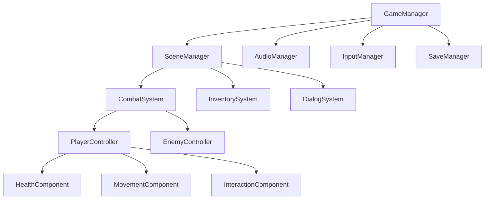
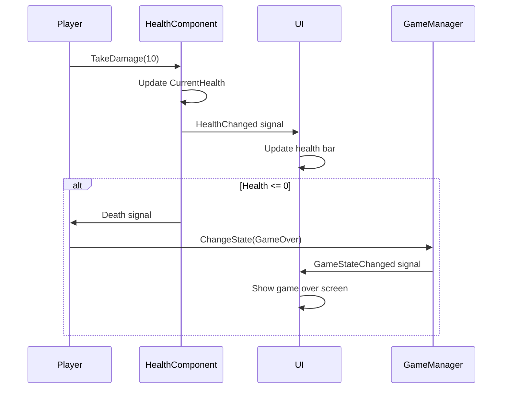

# Software Architecture

This document outlines the software architecture for **Ashes of Velsingrad**, a Godot 4.5.1 C# (.NET 9.0) game project. Understanding this architecture will help you navigate the codebase, make informed decisions, and contribute effectively to the project.

## Table of Contents

- [Architectural Overview](#architectural-overview)
- [Core Design Principles](#core-design-principles)
- [Project Structure](#project-structure)
- [System Architecture](#system-architecture)
- [Component Patterns](#component-patterns)
- [Data Flow](#data-flow)
- [Scene Management](#scene-management)
- [Performance Considerations](#performance-considerations)
- [Integration Points](#integration-points)

## Architectural Overview

### Technology Stack

- **Engine**: Godot 4.5.1 (Mono version)
- **Language**: C# (.NET 9.0)
- **Testing**: GdUnit4 with .NET Test SDK
- **Build System**: MSBuild/.NET CLI
- **Version Control**: Git with Conventional Commits

### Architectural Style

We follow a **Component-Based Architecture** with elements of:
- **Event-Driven Architecture** for decoupling systems
- **Layered Architecture** for clear separation of concerns
- **Manager Pattern** for global system coordination
- **Observer Pattern** for reactive components

## Core Design Principles

### 1. Separation of Concerns
Each script/class has a single, well-defined responsibility:
```csharp
// Good - Single responsibility
public class PlayerMovementController : Node
{
    // Only handles player movement logic
}

public class PlayerHealthSystem : Node
{
    // Only handles health/damage logic
}
```

### 2. Loose Coupling
Systems communicate through events and interfaces rather than direct references:
```csharp
// Loose coupling through signals
[Signal]
public delegate void PlayerDiedEventHandler();

// Interface-based dependencies
public class CombatSystem : Node
{
    private IDamageable _target;
}
```

### 3. High Cohesion
Related functionality is grouped together in logical modules:
```
scripts/
├── combat/
│   ├── DamageSystem.cs
│   ├── WeaponController.cs
│   └── CombatManager.cs
```

### 4. Testability
Code is designed to be easily testable with clear dependencies:
```csharp
public class InventorySystem : Node
{
    private readonly IItemDatabase _itemDatabase;

    public InventorySystem(IItemDatabase itemDatabase = null)
    {
        _itemDatabase = itemDatabase ?? GetNode<ItemDatabase>();
    }
}
```

## Project Structure

### Directory Organization

```
AshesOfVelsingrad/
├── scripts/                    # C# source code
│   ├── actors/                 # Game entities (Player, Enemies, NPCs)
│   │   ├── player/            # Player-specific systems
│   │   ├── enemies/           # Enemy AI and behaviors
│   │   └── npcs/              # Non-player characters
│   ├── components/            # Reusable game components
│   │   ├── health/            # Health/damage components
│   │   ├── movement/          # Movement components
│   │   └── interaction/       # Interaction components
│   ├── systems/               # Game systems
│   │   ├── combat/            # Combat mechanics
│   │   ├── inventory/         # Item management
│   │   ├── dialogue/          # Conversation system
│   │   └── save/              # Save/load system
│   ├── managers/              # Singleton managers
│   │   ├── GameManager.cs     # Core game state
│   │   ├── AudioManager.cs    # Sound management
│   │   ├── SceneManager.cs    # Scene transitions
│   │   └── InputManager.cs    # Input handling
│   │   ├── SettingsManager.cs # Game settings persistence
│   │   └── MenuManager.cs     # Menu navigation coordination
│   ├── ui/                    # User interface
│   │   ├── menus/             # Game menus
│   │   ├── hud/               # In-game UI
│   │   └── dialogs/           # Modal dialogs
│   ├── data/                  # Data structures
│   │   ├── items/             # Item definitions
│   │   ├── characters/        # Character stats
│   │   └── levels/            # Level configurations
│   └── utilities/             # Helper classes
│       ├── extensions/        # C# extensions
│       ├── constants/         # Game constants
│       └── helpers/           # Utility functions
├── scenes/                     # Godot scene files
│   ├── actors/                # Character scenes
│   ├── levels/                # Game levels
│   ├── ui/                    # UI scenes
│   └── main/                  # Main scenes
├── assets/                     # Game assets
│   ├── sprites/               # 2D graphics
│   ├── audio/                 # Sound effects and music
│   ├── fonts/                 # Typography
│   └── data/                  # JSON/XML data files
└── tests/                      # Test files
    ├── unit/                  # Unit tests
    └── integration/           # Integration tests
```

### Naming Conventions by Layer

| Layer | Convention | Example |
|-------|------------|---------|
| **Actors** | `[Entity][Purpose]` | `PlayerController`, `EnemyAI` |
| **Components** | `[Function]Component` | `HealthComponent`, `MovementComponent` |
| **Systems** | `[Domain]System` | `CombatSystem`, `InventorySystem` |
| **Managers** | `[Domain]Manager` | `GameManager`, `AudioManager` |
| **UI** | `[Element][Type]` | `MainMenu`, `HealthBar`, `DialogBox` |
| **Data** | `[Entity]Data` | `ItemData`, `CharacterData` |

## AutoLoad Configuration

### AutoLoad Best Practices

For Godot 4.x with C#, managers should be configured as AutoLoad using direct script files:

```
Project Settings > AutoLoad:
- SettingsManager: res://scripts/managers/SettingsManager.cs
- MenuManager: res://scripts/managers/MenuManager.cs
- GameManager: res://scripts/managers/GameManager.cs
```

**Important Notes:**
- Use `.cs` files directly, not `.tscn` scenes
- Order matters: dependencies should load first
- Managers automatically become available as singletons

### Deferred Initialization Pattern

When UI components need to access AutoLoad managers, use deferred initialization:

```csharp
public override void _Ready()
{
    // Defer initialization to ensure AutoLoad managers are ready
    CallDeferred(MethodName.DeferredReady);
}

private void DeferredReady()
{
    // Safe to access managers here
    ConnectSignals();
    InitializeUI();
}
```

## System Architecture

### Core Systems Hierarchy



### Manager Pattern Implementation

```csharp
// Base manager pattern
public abstract class BaseManager : Node
{
    public static BaseManager Instance { get; private set; }

    public override void _Ready()
    {
        if (Instance == null)
        {
            Instance = this;
            Initialize();
        }
        else
        {
            QueueFree(); // Ensure singleton
        }
    }

    protected abstract void Initialize();
}

// Concrete implementation
public class GameManager : BaseManager
{
    [Signal]
    public delegate void GameStateChangedEventHandler(GameState newState);

    public GameState CurrentState { get; private set; }

    protected override void Initialize()
    {
        // Initialize game state
        CurrentState = GameState.MainMenu;
    }

    public void ChangeState(GameState newState)
    {
        if (CurrentState != newState)
        {
            var previousState = CurrentState;
            CurrentState = newState;
            EmitSignal(SignalName.GameStateChanged, (int)newState);

            GD.Print($"Game state changed: {previousState} -> {newState}");
        }
    }
}
```

### Settings Management Pattern

```csharp
public class SettingsManager : BaseManager
{
    [Signal]
    public delegate void SettingsChangedEventHandler(string key, Variant value);

    private SettingsData _settings;

    protected override void Initialize()
    {
        LoadSettings();
    }

    public void SetSetting<T>(string key, T value)
    {
        // Update setting and emit signal for reactive UI updates
        _settings.SetValue(key, value);
        SaveSettings();
        EmitSignal(SignalName.SettingsChanged, key, Variant.From(value));
    }
}
```

### Menu Coordination Pattern

```csharp
public class MenuManager : BaseManager
{
    private readonly Dictionary<string, Control> _menus = new();
    private readonly Stack<string> _menuHistory = new();

    public void RegisterMenu(string menuName, Control menuControl)
    {
        _menus[menuName] = menuControl;
        // Connect navigation signals automatically
        ConnectMenuSignals(menuControl);
    }

    public void ShowMenu(string menuName, bool addToHistory = true)
    {
        // Handle transitions and history management
    }
}
```

## Component Patterns

### Component-Based Entity Design

```csharp
// Base actor class
public abstract class BaseActor : CharacterBody2D
{
    protected Dictionary<Type, BaseComponent> _components = new();

    public T GetComponent<T>() where T : BaseComponent
    {
        return _components.TryGetValue(typeof(T), out var component)
            ? (T)component
            : null;
    }

    public void AddComponent<T>(T component) where T : BaseComponent
    {
        _components[typeof(T)] = component;
        AddChild(component);
        component.Initialize(this);
    }
}

// Component base class
public abstract class BaseComponent : Node
{
    protected BaseActor Owner { get; private set; }

    public virtual void Initialize(BaseActor owner)
    {
        Owner = owner;
    }
}

// Concrete component example
public class HealthComponent : BaseComponent
{
    [Export] public int MaxHealth { get; set; } = 100;

    private int _currentHealth;

    [Signal]
    public delegate void HealthChangedEventHandler(int currentHealth, int maxHealth);

    [Signal]
    public delegate void DeathEventHandler();

    public int CurrentHealth
    {
        get => _currentHealth;
        private set
        {
            var oldHealth = _currentHealth;
            _currentHealth = Mathf.Clamp(value, 0, MaxHealth);

            if (oldHealth != _currentHealth)
            {
                EmitSignal(SignalName.HealthChanged, _currentHealth, MaxHealth);

                if (_currentHealth <= 0)
                {
                    EmitSignal(SignalName.Death);
                }
            }
        }
    }

    public override void Initialize(BaseActor owner)
    {
        base.Initialize(owner);
        _currentHealth = MaxHealth;
    }

    public void TakeDamage(int damage)
    {
        CurrentHealth -= damage;
    }

    public void Heal(int amount)
    {
        CurrentHealth += amount;
    }
}
```

### Usage Example

```csharp
public class Player : BaseActor
{
    public override void _Ready()
    {
        base._Ready();

        // Add components
        AddComponent(new HealthComponent { MaxHealth = 100 });
        AddComponent(new MovementComponent { Speed = 300.0f });
        AddComponent(new InteractionComponent());

        // Connect component signals
        var healthComponent = GetComponent<HealthComponent>();
        healthComponent.Death += OnPlayerDeath;
    }

    private void OnPlayerDeath()
    {
        GD.Print("Player died!");
        GameManager.Instance.ChangeState(GameState.GameOver);
    }
}
```

## Data Flow

### Event-Driven Communication



### Signal-Based Architecture

```csharp
// Producer (emits signals)
public class CombatSystem : Node
{
    [Signal]
    public delegate void DamageDealtEventHandler(Node target, int damage);

    [Signal]
    public delegate void CombatEndedEventHandler(Node winner);

    private void ProcessAttack(Node attacker, Node target, int damage)
    {
        // Process damage logic
        EmitSignal(SignalName.DamageDealt, target, damage);

        // Check combat end condition
        if (IsCombatEnded())
        {
            EmitSignal(SignalName.CombatEnded, DetermineWinner());
        }
    }
}

// Consumer (listens to signals)
public class StatisticsTracker : Node
{
    private int _totalDamageDealt;
    private int _combatsWon;

    public override void _Ready()
    {
        var combatSystem = GetNode<CombatSystem>("../CombatSystem");
        combatSystem.DamageDealt += OnDamageDealt;
        combatSystem.CombatEnded += OnCombatEnded;
    }

    private void OnDamageDealt(Node target, int damage)
    {
        _totalDamageDealt += damage;
    }

    private void OnCombatEnded(Node winner)
    {
        if (winner.IsInGroup("player"))
        {
            _combatsWon++;
        }
    }
}
```

### Data Management

```csharp
// Data layer abstraction
public interface IDataManager
{
    T Load<T>(string path) where T : class;
    void Save<T>(T data, string path) where T : class;
}

// Concrete implementation
public class JsonDataManager : Node, IDataManager
{
    public T Load<T>(string path) where T : class
    {
        if (!FileAccess.FileExists(path))
            return null;

        using var file = FileAccess.Open(path, FileAccess.ModeFlags.Read);
        var jsonString = file.GetAsText();

        return JsonSerializer.Deserialize<T>(jsonString);
    }

    public void Save<T>(T data, string path) where T : class
    {
        var jsonString = JsonSerializer.Serialize(data, new JsonSerializerOptions
        {
            WriteIndented = true
        });

        using var file = FileAccess.Open(path, FileAccess.ModeFlags.Write);
        file.StoreString(jsonString);
    }
}
```

## Scene Management

### Scene Architecture

```csharp
public class SceneManager : BaseManager
{
    private const string ScenesPath = "res://scenes/";

    private readonly Dictionary<string, PackedScene> _cachedScenes = new();
    private Node _currentScene;

    [Signal]
    public delegate void SceneChangedEventHandler(string sceneName);

    protected override void Initialize()
    {
        _currentScene = GetTree().CurrentScene;
    }

    public async void ChangeScene(string sceneName, bool useLoading = true)
    {
        if (useLoading)
        {
            ShowLoadingScreen();
        }

        // Unload current scene
        if (_currentScene != null)
        {
            _currentScene.QueueFree();
            await ToSignal(_currentScene, SceneTreeTimer.SignalName.TreeExited);
        }

        // Load new scene
        var newScene = await LoadSceneAsync(sceneName);
        GetTree().Root.AddChild(newScene);
        GetTree().CurrentScene = newScene;
        _currentScene = newScene;

        if (useLoading)
        {
            HideLoadingScreen();
        }

        EmitSignal(SignalName.SceneChanged, sceneName);
    }

    private async Task<Node> LoadSceneAsync(string sceneName)
    {
        var scenePath = $"{ScenesPath}{sceneName}.tscn";

        if (!_cachedScenes.ContainsKey(scenePath))
        {
            var resource = GD.Load<PackedScene>(scenePath);
            if (resource == null)
            {
                throw new FileNotFoundException($"Scene not found: {scenePath}");
            }
            _cachedScenes[scenePath] = resource;
        }

        // Simulate async loading for large scenes
        await Task.Delay(100);

        return _cachedScenes[scenePath].Instantiate();
    }
}
```

### Scene Hierarchy

```
Main Scene (persistent)
├── UI Layer (CanvasLayer)
│   ├── HUD
│   ├── Menus
│   └── Dialogs
├── Game Layer
│   ├── Current Level Scene
│   └── Player (persistent between levels)
├── Audio Layer
│   ├── Music Player
│   └── SFX Players
└── Managers (AutoLoad)
    ├── GameManager
    ├── SceneManager
    ├── AudioManager
    └── InputManager
```

## Performance Considerations

### Memory Management

```csharp
// Object pooling for frequently spawned objects
public class ProjectilePool : Node
{
    private readonly Queue<Projectile> _pool = new();
    private readonly PackedScene _projectileScene;

    public ProjectilePool()
    {
        _projectileScene = GD.Load<PackedScene>("res://scenes/actors/Projectile.tscn");
    }

    public Projectile GetProjectile()
    {
        if (_pool.Count > 0)
        {
            return _pool.Dequeue();
        }

        return _projectileScene.Instantiate<Projectile>();
    }

    public void ReturnProjectile(Projectile projectile)
    {
        projectile.Reset();
        projectile.GetParent()?.RemoveChild(projectile);
        _pool.Enqueue(projectile);
    }
}
```

### Efficient Update Patterns

```csharp
public class OptimizedUpdater : Node
{
    private readonly List<IUpdatable> _updateables = new();
    private float _updateInterval = 1.0f / 60.0f; // 60 FPS
    private float _timeSinceLastUpdate = 0.0f;

    public override void _Process(double delta)
    {
        _timeSinceLastUpdate += (float)delta;

        if (_timeSinceLastUpdate >= _updateInterval)
        {
            // Batch update all systems
            for (int i = _updateables.Count - 1; i >= 0; i--)
            {
                if (_updateables[i].IsValid())
                {
                    _updateables[i].Update(_timeSinceLastUpdate);
                }
                else
                {
                    _updateables.RemoveAt(i);
                }
            }

            _timeSinceLastUpdate = 0.0f;
        }
    }
}
```

## Integration Points

### External Systems Integration

```csharp
// Abstract integration point
public abstract class ExternalSystem : Node
{
    protected bool _isInitialized = false;

    public virtual async Task<bool> InitializeAsync()
    {
        try
        {
            await PerformInitialization();
            _isInitialized = true;
            return true;
        }
        catch (Exception ex)
        {
            GD.PrintErr($"Failed to initialize {GetType().Name}: {ex.Message}");
            return false;
        }
    }

    protected abstract Task PerformInitialization();
}

// Steam integration example
public class SteamIntegration : ExternalSystem
{
    protected override async Task PerformInitialization()
    {
        // Initialize Steam SDK
        // Set up achievements, leaderboards, etc.
        await Task.Delay(1000); // Simulated async initialization
        GD.Print("Steam integration initialized");
    }
}
```

### Testing Integration

```csharp
// Testable architecture with dependency injection
public class TestableGameSystem : Node
{
    private readonly IDataManager _dataManager;
    private readonly IAudioManager _audioManager;

    public TestableGameSystem(
        IDataManager dataManager = null,
        IAudioManager audioManager = null)
    {
        _dataManager = dataManager ?? GetNode<JsonDataManager>("DataManager");
        _audioManager = audioManager ?? GetNode<AudioManager>("AudioManager");
    }

    // Methods can be easily unit tested with mocked dependencies
    public void ProcessGameLogic()
    {
        var gameData = _dataManager.Load<GameData>("game_state.json");
        _audioManager.PlaySound("process_complete");
    }
}
```

---

## Architectural Guidelines

### Do's ✅
- Use composition over inheritance
- Favor dependency injection for testability
- Keep systems loosely coupled through events
- Follow single responsibility principle
- Use meaningful naming conventions
- Document complex architectural decisions

### Don'ts ❌
- Create circular dependencies
- Use static state excessively (except for managers)
- Mix UI logic with game logic
- Create god classes with multiple responsibilities
- Ignore memory management in frequently called code
- Skip error handling in integration points

### Evolution Strategy

This architecture is designed to evolve with the project:

1. **Phase 1** (Current): Basic component system with managers
2. **Phase 2**: Advanced ECS (Entity Component System) if needed
3. **Phase 3**: Microservices architecture for multiplayer features
4. **Phase 4**: Plugin architecture for modding support

The modular design ensures that individual systems can be refactored or replaced without affecting the entire codebase, supporting the project's long-term maintenance and scalability goals.
